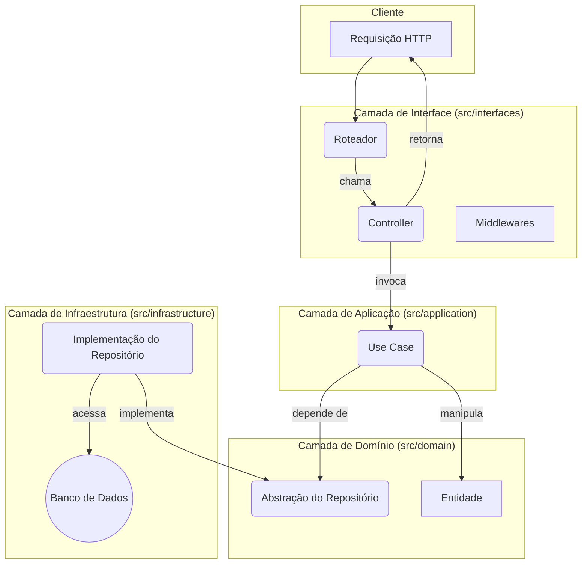
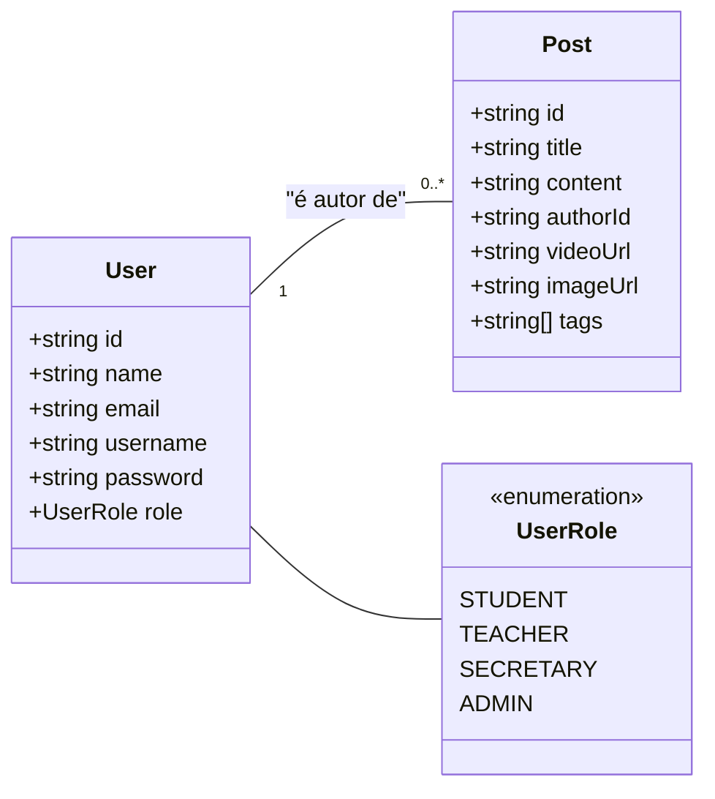
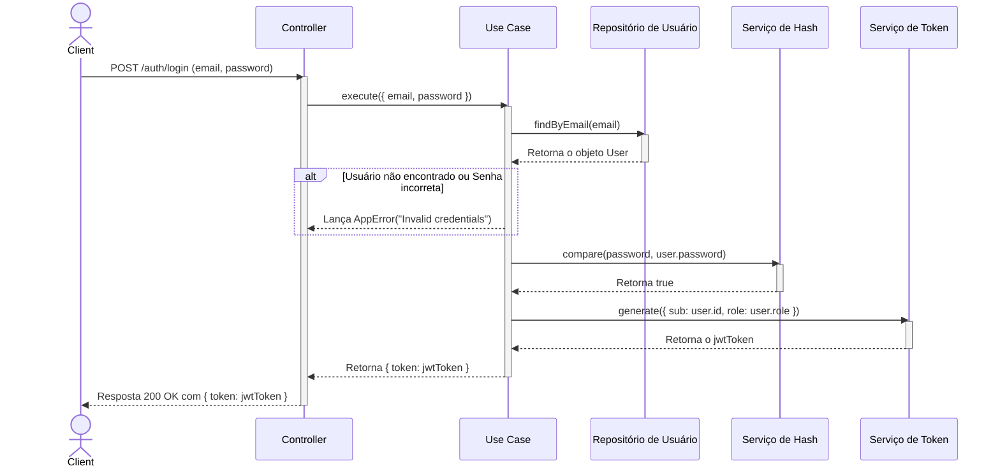

# Diagramas de Arquitetura

Esta seção contém representações visuais da arquitetura e do domínio da aplicação.

## Fluxo de uma Requisição (Clean Architecture)

O diagrama abaixo ilustra o fluxo de uma requisição através das camadas da aplicação, seguindo os princípios da Clean Architecture.

## Diagrama de Classes do Domínio

Este diagrama mostra a estrutura das principais entidades do domínio e seus relacionamentos.

## Diagrama de Sequência - Fluxo de Login

Este diagrama detalha a sequência de chamadas e interações entre os componentes do sistema durante o processo de autenticação de um usuário.

